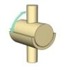
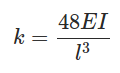
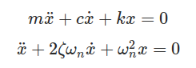
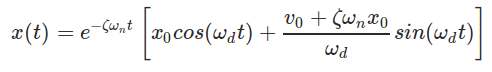

**Learning Objectives**

After completing this simulation experiment on free vibration of a simply supported beam one should be able to

<li>Model a given real system to an equivalent simplified model of a simply supported beam with suitable assumptions / idealizations.</li>
<li>Calculate the logarithmic decrement, damping ratio, damping frequency and natural frequency of the system</li>
<li>Find the stiffness and the critical damping of the system.</li>
<li>Calculate damping coefficient of the system.</li>

**Introduction**

A system is said to be a Simply Supported Beam system if it has a hinged connection at one end and roller connection in other end.

<figcaption align = "center">Rolller Support</figcaption>

<figcaption align = "center">Hinged Support</figcaption>

Vibration analysis of a Simply Supported beam system is important as it can explain and help us analyse a number of real life systems. The following few examples can be simplified to a simply supported beam, thereby helping us make design changes accordingly for the most efficient systems.

**Natural Frequency of Simply Supported Beam**

When given an excitation and left to vibrate on its own, the frequency at which a simply supported beam will oscillate is its natural frequency. This condition is called Free vibration. The value of natural frequency depends only on system parameters of mass and stiffness. When a real system is approximated to a simply supported beam, some assumptions are made for modelling and analysis (Important assumptions for undamped system are given below):

<li>The mass (m) of the whole system is considered to be lumped at the middle of the beam</li>

<li>No energy consuming element (damping) is present in the system i.e. undamped vibration</li>

<li>The complex cross section and type of material of the real system has been simplified to equate to a simply supported beam.</li>

The governing equation for such a system (spring mass system without damping under free vibration) is as below:

k the stiffness of the system is a property which depends on the length (l), moment of inertia (I) and Young's Modulus (E) of the material of the beam and for a simply supported beam is given by:

**Damping in a Simply Supported Beam**

Although there is no visible damper (dashpot) the real system has some amount of damping present in it. When a system with damping undergoes free vibration the damping property must also be considered for the modeling and analysis.

Single degree of freedom mass spring damper system under free vibration is governed by the following differential equation:

c is the damping present in the system and ζ is the damping factor of the system which is nothing but ratio of damping c and critical damping cc. Critical damping can be seen as the damping just sufficient to avoid oscillations. At critical condition ζ=1. For real systems the value of ζ is less than 1. For system where ζ < 1 the differential equation solution is a pair of complex conjugates. The displacement solution is given by

where x0 and v0 are initial displacement and velocity and ωd is the damped natural frequency of the system. The damped natural frequency is calculated as below:

